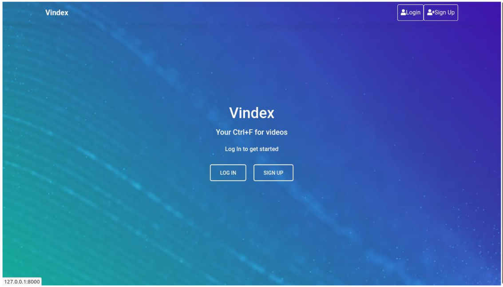
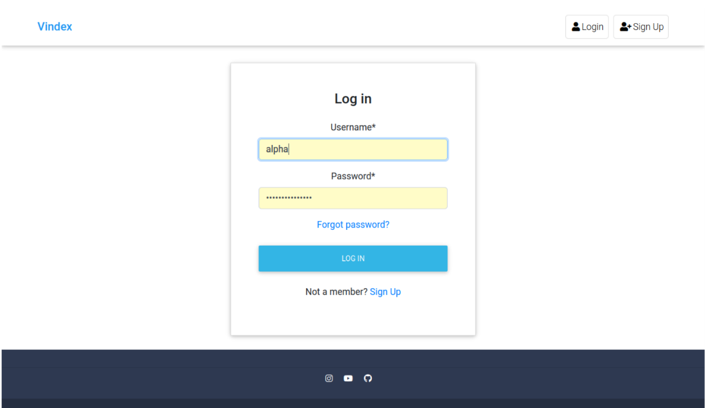
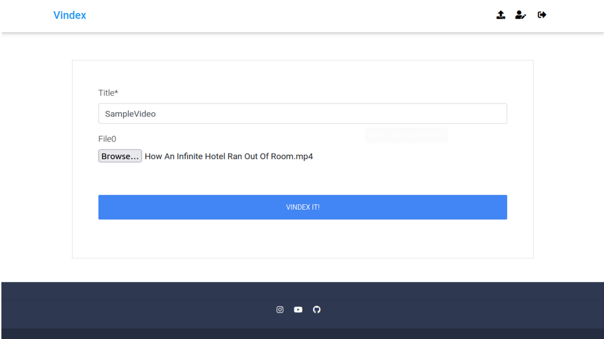
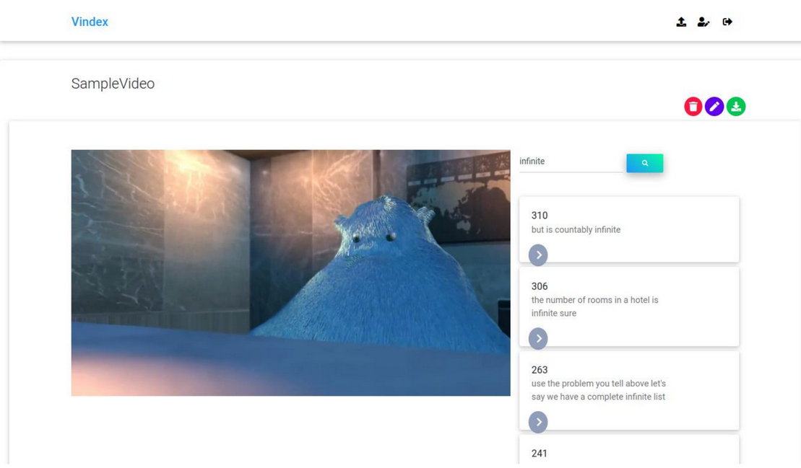

# Vindex

## _Web App to search within a video file_

Vindex is a web app designed to let users search for occurences of user-defined search terms within a video.

## Features

- Raw search:
  
  o Returns word to word search results if found

- Synonymous search:
  
  o Returns synonyms of words, if they exist, incase word to word search
  doesn’t match

- Web App:
  
  o An easy-to-use app for the end user

  o Login/Signup functionality

- Textual transcript generation:
  
  o User can download the transcription as well

## How does it work

User Signs Up and Logs in.

• User uploads the Video to the App.

• Audio is extracted from the app as wav format.

• Find Speech regions:

- Find the power of the signal Filter out low power signals( Silence) Note time stamps
  of the beginning of significant audio signals return timestamps

• Convert the speech areas to Free Lossless Audio Codec (FLACC)

• Converts the FLACC regions to text using Google Speech API

• Organize the returned text into a subtitle format [timestamp,text]

• After the transcription is generated user is redirected to the post view where the user has a search bar and the video player as well

• As the user enters a search term and clicks the search icon, an Asynchronous Javascript call activates the search view which in turn executes the search function, which returns the array
to the search view, The search view in turn returns a JSON response to the ajax call.

• Display the search results with an option to play from the occurrence or display “Not Found” if no match found.

## Installation

Requires Python >=3 to run.

Clone this repo

```sh
git clone https://github.com/wanixarif/vindexGUI
```

Install the dependencies & start the developmental server.

```sh
cd kickStarter
pip install -r requirements.txt
```

Create a postgresql database and set the required information in `project/settings.py`

```python

DATABASES = {
    'default': {
        'ENGINE': 'django.db.backends.postgresql_psycopg2',
        'NAME': 'YOUR_DATABASE_NAME',
    }
}
```

Then make the migrations

```sh
python manage.py makemigrations
python manage.py migrate
```

Then run the web app by

```sh
python manage.py runserver
```

## Screenshots









## License

GNU GPL V3
